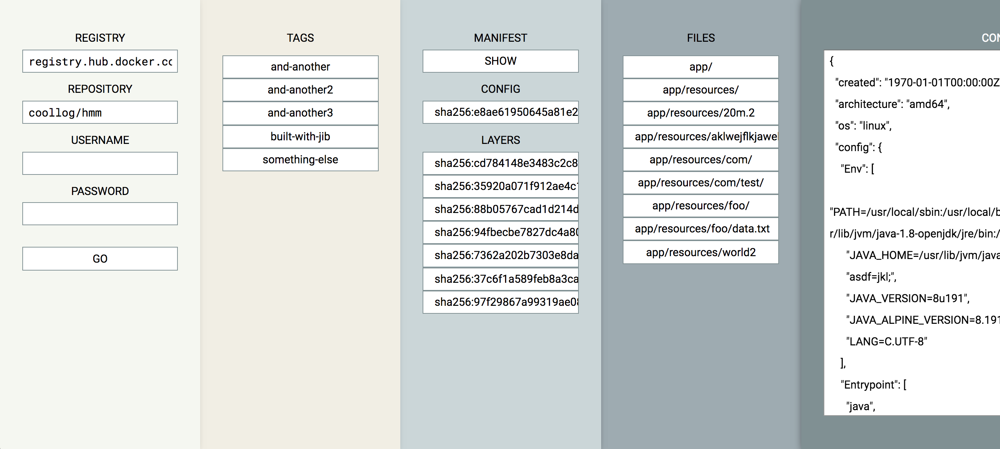

[](https://gitter.im/coollog/ContainerJS)

# ContainerJS

**Note: This is an experimental prototype. Do NOT use for production.**

ContainerJS is a (work-in-progress) JavaScript library for working with container images directly in your browser.

For a Java library, see [Jib Core](https://github.com/GoogleContainerTools/jib/tree/master/jib-core).\
For a Go library, see [go-containerregistry](https://github.com/google/go-containerregistry).\
For a Python library, see [containerregistry](https://github.com/google/containerregistry).

## Demo UI

[`inspect.html`](https://raw.githack.com/coollog/ContainerJS/master/inspect.html) includes a demo using ContainerJS. The UI allows you to browse container image repositories and inspect their image contents.

[](https://raw.githack.com/coollog/ContainerJS/master/inspect.html)

# How to use ContainerJS

```html
<!-- Do NOT use for production. -->
<script src="https://cdn.jsdelivr.net/gh/coollog/ContainerJS/container.js"></script>
```

```javascript
// Opens Docker Hub `busybox` repository.
const busybox = new Container.Repository('registry.hub.docker.com', 'library/busybox');

// Gets the tags for `busybox`.
const tags = await busybox.Tags;

// Gets the image `busybox:latest`.
const image = await busybox.Image('latest');

// Gets the manifest JSON for `busybox:latest`.
const manifestJSON = await image.ManifestJSON;

// Gets the config digest and JSON.
const config = await image.Config;
const configDigest = await config.digest;
const configJSON = await config.JSON;

// Gets the layer tar.gz.
const layers = await image.Layers;
const layerDigest = await layers[0].digest;
const layerArrayBuffer = await layers[0].arrayBuffer;
```

## Existing features

- Pull image, container configuration, and layers
- Works in Chrome, haven't tried other browsers
- Use credentials for private repositories

## Future features

- Add image pushing capability

## Contributions welcome!